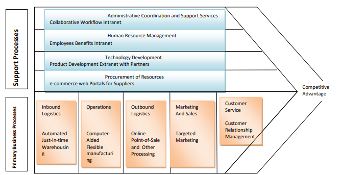

# Chapter 1: Fundamentals of Stategic Advantage

* Strategic information systems change the goals, operations, products, services, or environmental relationships of organisations to help them gain an edge over competitors.
  * Systems that have these effects may even change the business of the organisation by their goals, products, services or even relationships(internally or externally).
  * They can be used on all levels of the organization
  * These differ from strategic level systems for managers; those focus on long term decision making problems
* Two models of the firm and its environment have been used to identify areas of the business where information systems can provide advantage over competitors

### Competitive Force Model

* This focuses on the forces(threats and opportunities) that affect the way the business behaves
* Competitive advantage can be achieved by enhancing the firm’s ability to deal with customers, supplies, substitute products and services, and new entrants to market, which in turn may change the balance of power between a firm and other competitors in the industry in the firm’s favor.
* A company's success and livability depends on the five competitive forces that determines its structure, these are
  1. Rivalry of Competitors within its industry
  2. Threat of new entrants
  3. Threat posed by substitute products which can capture market share
  4. Bargaining power of customers
  5. Bargaining power of suppliers
* Strategies to handle the forces of a successful business may include but are not limited by include

1. Cost Leadership Strategy - Businesses can produce goods and services at a lower cost than competitors - Thus certain strategically oriented information systems can be implemented to help firms significantly lower their internal costs - For example - Wal-Mart uses an intentory replenishment system triggered by point-of-sale purchases to keep prices low and maintain stock - This system sends orders for new items to suppliers as soon as consumers pay for their purchases - Point-of-sale terminals record the bar code of each item passing the checkout counter and send a purchase transaction directly to a central terminal at Wal-Mart headquarters which transmits them to suppliers
2. Differentiation Strategy
   * Businesses create new market focus points using this strategy
     * This is done by identifying specific targets for products and services that is can most certainly dominate
   * Information systems can produce data to help improve their sales and increase productivity from existing information
   * Existing customers are less cost intensive that acquiring new ones thus information systems carefully examine transactions of customers as well as their activities to identify profitable customers
   * The differentiation strategy is therefore developing ways to differentiate a firm's products and services from its competitors' or reducing the differentiation advantages of competitors
3. Innovation Strategy
   * This focuses on finding new ways of doing business either through development of unique products and services or changing to a different market or making changes of procedures and processes
4. Alliance Strategies
   * This is the strategy of making new links and alliances with other businesses, customers, suppliers and others
   * These linkages may include mergers, acquisitions, joint ventures, forming of "virtual companies," or other marketing, manufacturing, or distribution agreements between a business and its trading partners.
     * Firms can make ties that are vital to the other party, this may lead to increase in switching cost and reduces customers' and suppliers' bargaining power
5.  Growth Strategies

    * This strategy is significantly expanding a company's capacity to produce goods and services, expanding into global markets, diversifying into new products and services, or integrating into related products and services.
    * A firm may achieve competitive advantage by pursuing one of these strategies or by pursuing several strategies simultaneously.

#### Other strategies include

* Locking in customers or suppliers
* Building switching costs
* Raising barriers to entry
* Leveraging investments in Information Technology

### Value Chain and Strategic Information Systems

* The value chain is a series (chain) of activities that include inbound logistics, warehouse and storage, production, finished product storage, outbound logistics, marketing and sales, and customer service.
  * Each of the services is checked to determine what can be done to increase or maintain the value known to the customer which also depends on their customer who aim for lower price, better service, high quality or uniqueness of a product
* This model focuses on specific activities in the business where strategies can be applied to have the best impact
  * It can support the competitive forces model by identifying specific, critical leverage points where a firm can use information technology most effectively to enhance its competitive position
* The activities needed to maximise productivity and reduce costs or gain profits are called **primary activities**

#### **Primary Activities**

* Primary Activities are activities tied to the production and distribution of the products and services that create value of customers of a firm
* These include
  * inbound logistics
    * These include receiving and storing materials for production
    * Operations transform inputs into finished products.
  * sales and marketing
    * Marketing and sales include promoting and selling the firm’s products.
  * service
    * The service activity includes maintenance and repair of the firm’s goods and services.

#### Support Activities

* These activities consist of organizational infrastructure(administration and management), human resources (employee recruiting, hiring, and training), technology (improving products and the production process), and procurement (purchasing inputs) that makes delivery of primary activities possible
* An information system could have a strategic impact if it helped the firm provide products or services at a lower cost than competitors but with a greater value.
